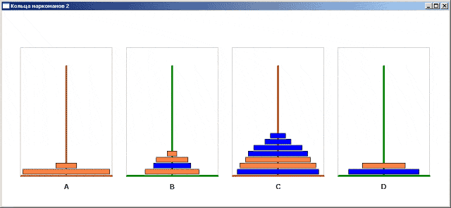

# 🗼 Hanoi Towers - Classic Puzzle Game



A multi-level implementation of the classic Tower of Hanoi puzzle, written in pure C++ using exclusively Win32 API and GDI functions. This vintage game from 2008 demonstrates the power of native Windows programming - delivering maximum performance in an incredibly compact executable.

## 🎮 Game Features

- **7 Diverse Levels** - Each level features different ring sizes and tower configurations
- **Progressive Difficulty** - From 3 towers with few rings to complex 5-tower challenges  
- **Pure Win32 Implementation** - No external dependencies, just raw Windows API power
- **Lightweight & Fast** - Minimal memory footprint with blazing-fast performance
- **Classic Puzzle Logic** - Traditional Hanoi rules with modern visual presentation

## 🎯 How to Play

The objective is simple yet challenging: move all rings from the leftmost tower to the rightmost tower following these rules:

1. **Only one ring can be moved at a time**
2. **A larger ring cannot be placed on top of a smaller ring**
3. **Complete all 7 levels to master the game!**

**Controls:**
- **Click** on a tower to select it
- **Click** on another tower to move the top ring
- **Mouse hover** shows your target destination

## 🏗️ Technical Specifications

- **Language:** Pure C++ (C++17 standard)
- **Graphics:** Win32 GDI (Graphics Device Interface)
- **Platform:** Windows (native Win32 application)
- **Build System:** CMake 3.16+
- **Architecture:** x64 optimized

### Why Win32 API?

This project showcases the elegance of native Windows programming:
- **Zero Dependencies** - No runtime libraries required
- **Instant Startup** - No framework initialization overhead  
- **Minimal Size** - Compact executable under 100KB
- **Maximum Performance** - Direct system calls without abstraction layers

## 🔧 Building from Source

### Prerequisites
- CMake 3.16 or higher
- Visual Studio 2019/2022 (Windows)
- MinGW-w64 (for cross-compilation)

### Windows Build
```bash
cmake -B build -S . -G "Visual Studio 17 2022" -A x64
cmake --build build --config Release
```

### Cross-compilation (macOS/Linux)
```bash
cmake -B build -S . -DCMAKE_TOOLCHAIN_FILE=mingw-w64-toolchain.cmake
cmake --build build
```

## 📦 Download

Get the latest compiled version from the [Releases](../../releases) section - no installation required, just download and run!

## 🕰️ Historical Context

Originally developed in 2008, this game represents an era when:
- **Performance mattered** - Every byte and CPU cycle was precious
- **Native code ruled** - Direct API access was the norm
- **Simplicity was elegant** - Clean code without unnecessary abstractions

This archive preserves that philosophy while being buildable with modern tools.

## 🎨 Game Levels

| Level | Towers | Rings | Difficulty |
|-------|--------|-------|------------|
| 1     | 3      | 3     | Beginner   |
| 2     | 3      | 4     | Easy       |
| 3     | 3      | 5     | Medium     |
| 4     | 4      | 4     | Medium+    |
| 5     | 4      | 5     | Hard       |
| 6     | 5      | 5     | Expert     |
| 7     | 5      | 6     | Master     |

## 🏆 Challenge Yourself

Can you solve all 7 levels? The mathematical minimum moves for n rings is **2ⁿ - 1**, but can you achieve it?

---

*A nostalgic journey back to the golden age of native Windows programming* ⚡
